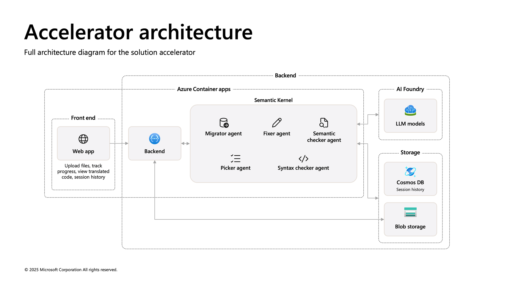

# Modernize your code solution accelerator

Table of contents: [**User story**](#user-story) \| [**One-click deploy**](#one-click-deploy) \| [**Supporting documents**](#supporting-documents) \|  [**Customer truth**](#customer-truth)

  

## User story

**Overview**

Welcome to the *Modernize your code* solution accelerator, designed to help customers transition their SQL queries to new environments quickly and efficiently. This accelerator is particularly useful for organizations modernizing their data estates, as it simplifies the process of translating SQL queries from various dialects.

When dealing with legacy code, users often face significant challenges, including the absence of proper documentation, loss of knowledge of outdated languages, and missing business logic that explains functional requirements.

The *Modernize your code* solution accelerator allows users to specify a group of SQL queries and the target SQL dialect for translation. It then initiates a batch process where each query is translated using a group of Large Language Model (LLM) agents. This automation not only saves time but also ensures accuracy and consistency in query translation.

**Key features**

<picture>
  <source media="(prefers-color-scheme: dark)" srcset=".\documentation\images\keyFeaturesDark.png">
  <source media="(prefers-color-scheme: light)" srcset=".\documentation\images\keyFeaturesLight.png">
  
</picture>

 
 

Below is an image of the solution accelerator:

 

**Scenario**

Companies maintaining and modernizing their data estates often face large migration projects. They may have volumes of files in various dialects, which need to be translated into a modern alternative. Some of the challenges they face include:

<ul><li>Difficulty analyzing and maintaining legacy systems due to missing documentation</li>
<li>Time-consuming process to manually update legacy code and extract missing business logic</li>
<li>High risk of errors from manual translations, which can lead to incorrect query results and data integrity issues</li>
<li>Lack of available knowledge and expertise for legacy languages creates additional effort, cost, and reliance on niche skills</li></ul>

By using the *Modernize your code* solution accelerator, users can automate this process, ensuring that all queries are accurately translated and ready for use in the new modern environment.

The sample data used in this repository is synthetic and generated using Azure Open AI service. The data is intended for use as sample data only.

**Accelerator architecture**

 

**Agentic architecture**

 

This diagram double-clicks into the agentic framework for the code conversion process. The conversion uses an agentic approach with each agent playing a specialized role in the process. The system gets a list of SQL files which are targeted for conversion. 

**Step 1:** The system loops through the list of SQL files, converting each file, starting by passing the SQL to the Migrator agent. This agent will create several candidate SQL files that should be equivalent. It does this to ensure that the system acknowledges that most of these queries could be converted in a number of different ways. *Note that the processing time can vary depending on OpenAI and cloud services.*

**Step 2:** The Picker agent then examines these various possibilities and picks the one it believes is best using criteria such as simplicity, clarity of syntax, etc.

**Step 3:** This query is sent to the Syntax checker agent which, using a command line tool designed to validate SQL syntax, checks to make sure the query should run without error.
- **Step 3n:** If the Syntax checker agent finds potential errors, it then in Step 3n sends the query to a Fixer agent which will attempt to fix the problem. The Fixer agent then sends the fixed query back to the Syntax checker agent again. If there are still errors, the Syntax checker agent sends back to the Fixer agent to make another attempt. This iteration continues until, either there are no errors found, or a max number of allowed iterations is reached. If the max number is hit, error logs are generated for that query and stored in its Cosmos DB metadata. 

**Step 4:** Once the SQL is found to run without errors, it is sent for a final check to the Semantic checker agent. This agent makes sure that the query in the new syntax will have the same logical effects as the old query, with no extra effects. It can find edge cases which don’t apply to most scenarios, so, if it finds an issue, this issue is sent to the query logs, and the query is generated and the file will be present in storage, but its state will be listed as “warning”.  If no semantic issues are found, the query is generated and placed into Azure storage with a state of success.

 

 

## One-click deploy

**Prerequisites**

* To use this solution accelerator, you will need access to an [Azure subscription](https://azure.microsoft.com/free/) with permission to create resource groups and resources. For more detailed prerequisites, review the deployment options in the following section.

* This accelerator can be deployed with or without authentication. 

  * To install with authentication requires that the installer have the rights to create and register an application identity in their Azure environment.
  This is controlled through the Authorization field in the installation form. If you do not have this permission, or are not sure, you can start with the no authorization option to view and experiment with the accelerator.
  * Note: If you install with authentication, all processing history and current processing will be performed for your specific user. If you deploy without authentication, all batch history from the tool will be visible to all users.
 
**Deploy with Bicep**

1. Please check the link [Azure Products by Region](https://azure.microsoft.com/en-us/explore/global-infrastructure/products-by-region/?products=all&regions=all) and choose a region where Azure AI Search, Azure OpenAI services, Azure AI Foundry Services are available. 

1. **Deploy Azure resources**  
   Click the following deployment button to create the required resources for this accelerator directly in your Azure Subscription.

   

   Most fields will have a default name set already. You will need to update the following Azure OpenAI settings:

    -  Region - the region where the resources will be created in

    -  Authorization - Controls whether you would like to install with authorization enabled

    -  Solution Prefix - provide a 6 alphanumeric value that will be used to prefix resources

    -  Other Location - location of resources (required for Azure SQL and CosmoDB resources)

 

## Supporting documents

**Additional resources**

- [Microsoft Fabric documentation - Microsoft Fabric | Microsoft Learn](https://learn.microsoft.com/en-us/fabric/)
- [Azure OpenAI Service - Documentation, quickstarts, API reference - Azure AI services | Microsoft Learn](https://learn.microsoft.com/en-us/azure/ai-services/openai/concepts/use-your-data)
- [Azure AI Content Understanding documentation](https://learn.microsoft.com/en-us/azure/ai-services/content-understanding/)
- [Azure AI Foundry documentation](https://learn.microsoft.com/en-us/azure/ai-studio/)
- [Speech service documentation - Tutorials, API Reference - Azure AI services - Azure AI services | Microsoft Learn](https://learn.microsoft.com/en-us/azure/ai-services/speech-service/)

**Version history**

This is the first version of the *Modernize your code* solution accelerator.

**Responsible AI Transparency FAQ**

Please refer to [Transparency FAQ](./TRANSPARENCY_FAQ.md) for responsible AI transparency details of this solution accelerator.

 

## Customer truth

Customer stories coming soon.

 

## Disclaimers

To the extent that the Software includes components or code used in or derived from Microsoft products or services, including without limitation Microsoft Azure Services (collectively, “Microsoft Products and Services”), you must also comply with the Product Terms applicable to such Microsoft Products and Services. You acknowledge and agree that the license governing the Software does not grant you a license or other right to use Microsoft Products and Services. Nothing in the license or this ReadMe file will serve to supersede, amend, terminate or modify any terms in the Product Terms for any Microsoft Products and Services. 

You must also comply with all domestic and international export laws and regulations that apply to the Software, which include restrictions on destinations, end users, and end use. For further information on export restrictions, visit https://aka.ms/exporting. 

You acknowledge that the Software and Microsoft Products and Services (1) are not designed, intended or made available as a medical device(s), and (2) are not designed or intended to be a substitute for professional medical advice, diagnosis, treatment, or judgment and should not be used to replace or as a substitute for professional medical advice, diagnosis, treatment, or judgment. Customer is solely responsible for displaying and/or obtaining appropriate consents, warnings, disclaimers, and acknowledgements to end users of Customer’s implementation of the Online Services. 

You acknowledge the Software is not subject to SOC 1 and SOC 2 compliance audits. No Microsoft technology, nor any of its component technologies, including the Software, is intended or made available as a substitute for the professional advice, opinion, or judgement of a certified financial services professional. Do not use the Software to replace, substitute, or provide professional financial advice or judgment.  

BY ACCESSING OR USING THE SOFTWARE, YOU ACKNOWLEDGE THAT THE SOFTWARE IS NOT DESIGNED OR INTENDED TO SUPPORT ANY USE IN WHICH A SERVICE INTERRUPTION, DEFECT, ERROR, OR OTHER FAILURE OF THE SOFTWARE COULD RESULT IN THE DEATH OR SERIOUS BODILY INJURY OF ANY PERSON OR IN PHYSICAL OR ENVIRONMENTAL DAMAGE (COLLECTIVELY, “HIGH-RISK USE”), AND THAT YOU WILL ENSURE THAT, IN THE EVENT OF ANY INTERRUPTION, DEFECT, ERROR, OR OTHER FAILURE OF THE SOFTWARE, THE SAFETY OF PEOPLE, PROPERTY, AND THE ENVIRONMENT ARE NOT REDUCED BELOW A LEVEL THAT IS REASONABLY, APPROPRIATE, AND LEGAL, WHETHER IN GENERAL OR IN A SPECIFIC INDUSTRY. BY ACCESSING THE SOFTWARE, YOU FURTHER ACKNOWLEDGE THAT YOUR HIGH-RISK USE OF THE SOFTWARE IS AT YOUR OWN RISK.  
