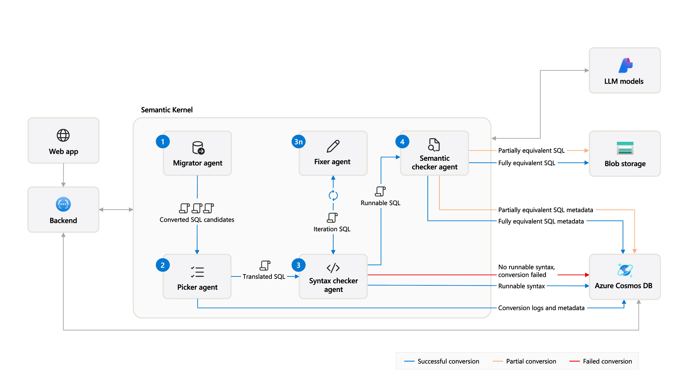

# Modernize your code solution accelerator

Welcome to the *Modernize your code* solution accelerator, designed to help customers transition their SQL queries to new environments quickly and efficiently. This accelerator is particularly useful for organizations modernizing their data estates, as it simplifies the process of translating SQL queries from various dialects.

When dealing with legacy code, users often face significant challenges, including the absence of proper documentation, loss of knowledge of outdated languages, and missing business logic that explains functional requirements.

The Modernize your code solution accelerator allows users to specify a group of SQL queries and the target SQL dialect for translation. It then initiates a batch process where each query is translated using a group of Large Language Model (LLM) agents. This automation not only saves time but also ensures accuracy and consistency in query translation.
 

  
[**SOLUTION OVERVIEW**](#solution-overview) \| [**QUICK DEPLOY**](#quick-deploy) \| [**BUSINESS SCENARIO**](#business-scenario) \| [**SUPPORTING DOCUMENTATION**](#supporting-documentation)

 

<h2>
Solution overview
</h2>

The solution leverages Azure AI Foundry, Azure OpenAI Service, Azure Container Apps, Azure Cosmos DB, and Azure Storage to create an intelligent code modernization pipeline. It uses a multi-agent approach where specialized AI agents work together to translate, validate, and optimize SQL queries for the target environment.

### Solution architecture
||
|---|

### Agentic architecture
||
|---|

### How to customize
If you'd like to customize the solution accelerator, here are some common areas to start:

[Custom scenario](./docs/CustomizingScenario.md)

 

### Additional resources

[Azure AI Foundry documentation](https://learn.microsoft.com/en-us/azure/ai-studio/)

[Semantic Kernel Agent Framework](https://learn.microsoft.com/en-us/semantic-kernel/frameworks/agent/?pivots=programming-language-python)

[Azure OpenAI Service Documentation](https://learn.microsoft.com/en-us/azure/ai-services/openai/concepts/use-your-data)

 

### Key features

  
Click to learn more about the key features this solution enables

  - **Code language modernization**  
  Modernizing outdated code ensures compatibility with current technologies, reduces reliance on legacy expertise, and keeps businesses competitive.
  
  - **Summary and review of new code**  
  Generating summaries and translating code files keeps humans in the loop, enhances their understanding, and facilitates timely interventions, ensuring the files are ready to export.

  - **Business logic analysis**  
  Leveraging AI to decipher business logic from legacy code helps minimizes the risk of human error.

  - **Efficient code transformation**  
  Streamlining the process of analyzing, converting, and iterative error testing reduces time and effort required to modernize the systems.

  
<h2>
Quick deploy
</h2>

### How to install or deploy
Follow the quick deploy steps on the deployment guide to deploy this solution to your own Azure subscription.

[Click here to launch the deployment guide](./docs/DeploymentGuide.md)
  

|  |  |
|---|---|
 
 

> ⚠️ **Important: Check Azure OpenAI Quota Availability**
  To ensure sufficient quota is available in your subscription, please follow [quota check instructions guide](./docs/quota_check.md) before you deploy the solution.

 

### Prerequisites and Costs

To deploy this solution accelerator, ensure you have access to an [Azure subscription](https://azure.microsoft.com/free/) with the necessary permissions to create **resource groups, resources, app registrations, and assign roles at the resource group level**. This should include Contributor role at the subscription level and Role Based Access Control role on the subscription and/or resource group level. Follow the steps in [Azure Account Set Up](./docs/AzureAccountSetUp.md).

Check the [Azure Products by Region](https://azure.microsoft.com/en-us/explore/global-infrastructure/products-by-region/?products=all&regions=all) page and select a **region** where the following services are available: Azure AI Foundry, Azure OpenAI Service, and GPT Model Capacity.

Here are some example regions where the services are available: East US, East US2, Japan East, UK South, Sweden Central.

Pricing varies per region and usage, so it isn't possible to predict exact costs for your usage. The majority of the Azure resources used in this infrastructure are on usage-based pricing tiers. However, Azure Container Registry has a fixed cost per registry per day.

Use the [Azure pricing calculator](https://azure.microsoft.com/en-us/pricing/calculator) to calculate the cost of this solution in your subscription.

| Product | Description | Cost |
|---|---|---|
| [Azure AI Foundry](https://learn.microsoft.com/azure/ai-studio/) | Used for AI agent orchestration and management | [Pricing](https://azure.microsoft.com/pricing/details/ai-studio/) |
| [Azure OpenAI Service](https://learn.microsoft.com/azure/ai-services/openai/) | Powers the AI agents for code translation | [Pricing](https://azure.microsoft.com/pricing/details/cognitive-services/openai-service/) |
| [Azure Container Apps](https://learn.microsoft.com/azure/container-apps/) | Hosts the web application frontend | [Pricing](https://azure.microsoft.com/pricing/details/container-apps/) |
| [Azure Cosmos DB](https://learn.microsoft.com/azure/cosmos-db/) | Stores metadata and processing results | [Pricing](https://azure.microsoft.com/pricing/details/cosmos-db/) |
| [Azure Storage Account](https://learn.microsoft.com/azure/storage/) | Stores SQL files and processing artifacts | [Pricing](https://azure.microsoft.com/pricing/details/storage/blobs/) |
| [Azure Container Registry](https://learn.microsoft.com/azure/container-registry/) | Stores container images for deployment | [Pricing](https://azure.microsoft.com/pricing/details/container-registry/) |

 

>⚠️ **Important:** To avoid unnecessary costs, remember to take down your app if it's no longer in use,
either by deleting the resource group in the Portal or running `azd down`.

  
<h2>
Business Scenario
</h2>

||
|---|

 

Companies maintaining and modernizing their data estates often face large migration projects. They may have volumes of files in various dialects, which need to be translated into a modern alternative. Some of the challenges they face include:

- Difficulty analyzing and maintaining legacy systems due to missing documentation
- Time-consuming process to manually update legacy code and extract missing business logic
- High risk of errors from manual translations, which can lead to incorrect query results and data integrity issues
- Lack of available knowledge and expertise for legacy languages creates additional effort, cost, and reliance on niche skills

By using the *Modernize your code* solution accelerator, users can automate this process, ensuring that all queries are accurately translated and ready for use in the new modern environment.

For an in-depth look at the applicability of using multiple agents for this code modernization use case, please see the [supporting AI Research paper](./docs/modernize_report.pdf).

The sample data used in this repository is synthetic and generated using Azure Open AI service. The data is intended for use as sample data only.

⚠️ The sample data used in this repository is synthetic and generated using Azure OpenAI service. The data is intended for use as sample data only.

### Business value

  
Click to learn more about what value this solution provides

  - **Accelerated Migration**  
  Automate the translation of SQL queries, significantly reducing migration time and effort.

  - **Error Reduction**  
  Multi-agent validation ensures accurate translations and maintains data integrity.

  - **Knowledge Preservation**  
  Captures and preserves business logic during the modernization process.

  - **Cost Efficiency**  
  Reduces reliance on specialized legacy system expertise and manual translation efforts.

  - **Standardization**  
  Ensures consistent query translation across the organization.

  

<h2>
Supporting documentation
</h2>

### Security guidelines

This template uses Azure Key Vault for use by AI Foundry.

This template uses [Managed Identity](https://learn.microsoft.com/entra/identity/managed-identities-azure-resources/overview) for all Azure service communication.

To ensure continued best practices in your own repository, we recommend that anyone creating solutions based on our templates ensure that the [Github secret scanning](https://docs.github.com/code-security/secret-scanning/about-secret-scanning) setting is enabled.

You may want to consider additional security measures, such as:

* Enabling Microsoft Defender for Cloud to [secure your Azure resources](https://learn.microsoft.com/en-us/azure/defender-for-cloud/).
* Protecting the Azure Container Apps instance with a [firewall](https://learn.microsoft.com/azure/container-apps/waf-app-gateway) and/or [Virtual Network](https://learn.microsoft.com/azure/container-apps/networking?tabs=workload-profiles-env%2Cazure-cli).

 

### Cross references
Check out similar solution accelerators

| Solution Accelerator | Description |
|---|---|
| [Documen Knowledge Mining](https://github.com/microsoft/Document-Knowledge-Mining-Solution-Accelerator) | Extract structured information from unstructured documents using AI |
| [Multi Agent Custom Automation Engine Solution Acceleratorr](https://github.com/microsoft/Multi-Agent-Custom-Automation-Engine-Solution-Accelerator/tree/main) | An AI-driven orchestration system that manages a group of AI agents to accomplish tasks based on user input |
| [Conversation Knowledge Mining](https://github.com/microsoft/Conversation-Knowledge-Mining-Solution-Accelerator) | Enable organizations to derive insights from volumes of conversational data using generative AI |

    

## Provide feedback

Have questions, find a bug, or want to request a feature? [Submit a new issue](https://github.com/microsoft/Modernize-your-Code-Solution-Accelerator/issues) on this repo and we'll connect.

 

## Responsible AI Transparency FAQ 
Please refer to [Transparency FAQ](./TRANSPARENCY_FAQS.md) for responsible AI transparency details of this solution accelerator.

 

## Disclaimers

To the extent that the Software includes components or code used in or derived from Microsoft products or services, including without limitation Microsoft Azure Services (collectively, "Microsoft Products and Services"), you must also comply with the Product Terms applicable to such Microsoft Products and Services. You acknowledge and agree that the license governing the Software does not grant you a license or other right to use Microsoft Products and Services. Nothing in the license or this ReadMe file will serve to supersede, amend, terminate or modify any terms in the Product Terms for any Microsoft Products and Services. 

You must also comply with all domestic and international export laws and regulations that apply to the Software, which include restrictions on destinations, end users, and end use. For further information on export restrictions, visit https://aka.ms/exporting. 

You acknowledge that the Software and Microsoft Products and Services (1) are not designed, intended or made available as a medical device(s), and (2) are not designed or intended to be a substitute for professional medical advice, diagnosis, treatment, or judgment and should not be used to replace or as a substitute for professional medical advice, diagnosis, treatment, or judgment. Customer is solely responsible for displaying and/or obtaining appropriate consents, warnings, disclaimers, and acknowledgements to end users of Customer's implementation of the Online Services. 

You acknowledge the Software is not subject to SOC 1 and SOC 2 compliance audits. No Microsoft technology, nor any of its component technologies, including the Software, is intended or made available as a substitute for the professional advice, opinion, or judgement of a certified financial services professional. Do not use the Software to replace, substitute, or provide professional financial advice or judgment.  

BY ACCESSING OR USING THE SOFTWARE, YOU ACKNOWLEDGE THAT THE SOFTWARE IS NOT DESIGNED OR INTENDED TO SUPPORT ANY USE IN WHICH A SERVICE INTERRUPTION, DEFECT, ERROR, OR OTHER FAILURE OF THE SOFTWARE COULD RESULT IN THE DEATH OR SERIOUS BODILY INJURY OF ANY PERSON OR IN PHYSICAL OR ENVIRONMENTAL DAMAGE (COLLECTIVELY, "HIGH-RISK USE"), AND THAT YOU WILL ENSURE THAT, IN THE EVENT OF ANY INTERRUPTION, DEFECT, ERROR, OR OTHER FAILURE OF THE SOFTWARE, THE SAFETY OF PEOPLE, PROPERTY, AND THE ENVIRONMENT ARE NOT REDUCED BELOW A LEVEL THAT IS REASONABLY, APPROPRIATE, AND LEGAL, WHETHER IN GENERAL OR IN A SPECIFIC INDUSTRY. BY ACCESSING THE SOFTWARE, YOU FURTHER ACKNOWLEDGE THAT YOUR HIGH-RISK USE OF THE SOFTWARE IS AT YOUR OWN RISK. 