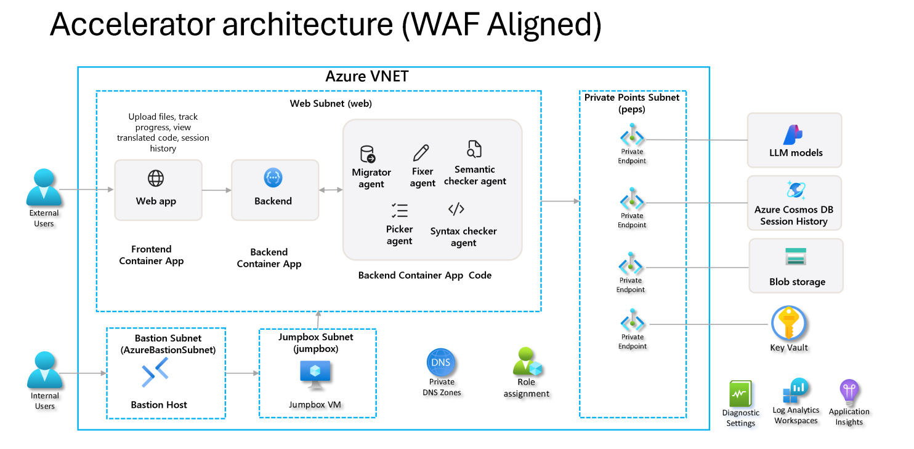

# Azure WAF-Aligned Architecture

This architecture implements [Azure Well-Architected Framework (WAF)](https://learn.microsoft.com/en-us/azure/well-architected/) principles for enterprise-grade deployments, deployed with the WAF-Aligned deployment option: 

## WAF Pillars Implementation

###  Security
- **Zero Trust Network:** Private VNet with private endpoints for all PaaS services
- **Identity & Access:** Managed identities with RBAC and least-privilege access
- **Secure Admin Access:** Azure Bastion + Jumpbox for internal administration
- **Secrets Management:** Azure Key Vault integration
- **Internal Backend APIs:** Backend Container Apps use internal-only ingress, accessible only within the VNet; all external traffic is proxied through the frontend

###  Operational Excellence  
- **Observability:** Centralized logging via Log Analytics Workspace
- **Application Monitoring:** Application Insights for telemetry and diagnostics
- **Infrastructure as Code:** Bicep templates with parameterized configurations

### Performance Efficiency
- **Auto-scaling:** Container Apps with configurable scaling policies
- **Regional Proximity:** Resources deployed in optimal Azure regions

###  Cost Optimization
- **Right-sizing:** Parameterized SKUs and capacity settings
- **Resource Sharing:** Shared networking and monitoring infrastructure

###  Reliability
- **High Availability:** Multi-zone deployment options
- **Data Redundancy:** Configurable geo-replication for critical data stores
- **Private Connectivity:** Eliminates internet dependencies

## Core Architecture Components

| Component | Purpose | WAF Alignment |
|-----------|---------|---------------|
| **Virtual Network** | Network isolation boundary | Security, Reliability |
| **Private Endpoints** | Secure PaaS connectivity (AI Services, Storage, Cosmos DB, Key Vault) | Security |
| **Private DNS Zones** | Internal name resolution | Security, Reliability |
| **Azure Bastion + Jumpbox** | Secure administrative access | Security |
| **Container Apps** | Application hosting with VNet integration | Performance, Reliability |
| **Log Analytics + App Insights** | Centralized monitoring and diagnostics | Operational Excellence |

## Network Topology (WAF Deployment)

When deployed with the WAF-aligned option (`enablePrivateNetworking: true`), the network is configured as follows:

### Container Apps
- **Frontend Container App** – External ingress (`ingressExternal: true`). Publicly accessible; serves the React SPA and acts as a reverse proxy for backend API calls.
- **Backend Container App** – Internal-only ingress (`ingressExternal: false`). Not reachable from the public internet. Only accessible within the Container Apps Environment VNet.

### Traffic Flow
1. **User → Frontend**: Users access the frontend web application over HTTPS via the frontend Container App's public FQDN.
2. **Frontend → Backend (proxy)**: All API and WebSocket calls from the browser are sent to the frontend server, which reverse-proxies them to the internal backend over the VNet.
3. **Backend → PaaS Services**: The backend communicates with Azure PaaS services (Cosmos DB, Storage, AI Services, Key Vault) exclusively via private endpoints within the VNet.

### NSG Rules
The `web` subnet (shared by both Container Apps) has the following Network Security Group rules:
- **AllowHttpsInbound** (priority 100): Allows HTTPS traffic from the internet to reach the frontend.
- **AllowIntraSubnetTraffic** (priority 200): Allows all traffic within the subnet, enabling the frontend to proxy requests to the internal backend.
- **AllowAzureLoadBalancer** (priority 300): Allows Azure Load Balancer health probes.

The `ingressExternal: false` setting on the backend is enforced by the Container Apps platform, so even though the NSG allows inbound HTTPS to the subnet, the platform will not route external traffic to the backend container.

## Deployment Configuration
- **Configurable Parameters:** If user selects to deploy as WAF Aligned, Parameters like Monitoring, Scaling, VPN will get enabled.
- **Network-first Design:** All components deployed within private network boundaries
- **Enterprise-ready:** Production-grade security and monitoring enabled

## Application Information Flow

The application information flow remains the same for both 'sandbox' and 'waf-aligned' configuration. 

The solution is composed of several services:

- The web app front end and the backend app logic are containerized and run from Azure Container service instances. 
- In WAF-aligned deployments, the frontend reverse-proxies all `/api/*` and WebSocket requests to the backend, which is only accessible internally.
- When a request for conversion is created in the web app admin console, the user specifies what files should be converted and the target SQL dialect for conversion. 
- These files are then uploaded to blob storage and initial data about the request is stored in Cosmos DB. 
- The conversion takes place using appropriate LLM models using multiple agents, with each agent having a dedicated purpose in the conversion process. As files are converted, they are placed into blob storage, with metadata collected into Cosmos detailing the conversion process and the current state of the batch. 
- Cosmos also stores the logs from the individual agents so the results can be fully reviewed before any of the converted files are put into production.
