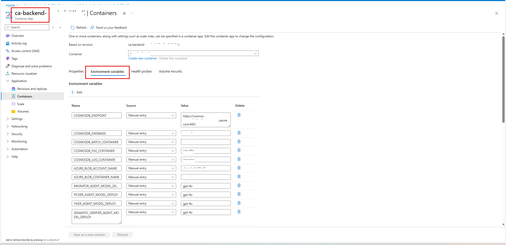
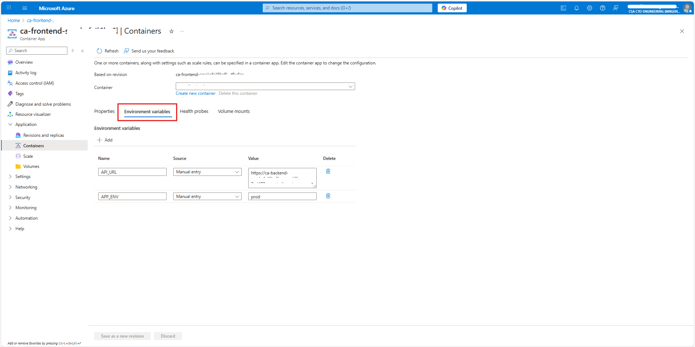

# Local Development Setup Guide

This guide provides comprehensive instructions for setting up the Modernize your code Solution Accelerator for local development across Windows and Linux platforms.

## Important Setup Notes

### Multi-Service Architecture

This application consists of **two separate services** that run independently:

1. **Backend API** - REST API server providing migration and SQL agent services
2. **Frontend** - React-based user interface

> **⚠️ Critical: Each service must run in its own terminal/console window**
>
> - **Do NOT close terminals** while services are running
> - Open **2 separate terminal windows** for local development
> - Each service will occupy its terminal and show live logs
>
> **Terminal Organization:**
> - **Terminal 1**: Backend API - HTTP server on port 8000
> - **Terminal 2**: Frontend - Development server on port 5173

### Path Conventions

**All paths in this guide are relative to the repository root directory:**

```bash
Modernize-your-code-solution-accelerator/    ← Repository root (start here)
├── src/
│   ├── backend/                           
│   │   ├── .venv/                          ← Virtual environment
│   │   ├── app.py                          ← API entry point
│   │   ├── requirements.txt                ← Python dependencies
│   │   └── .env                            ← Backend config file
│   └── frontend/                           
│       ├── node_modules/                    
│       ├── package.json                    ← Node dependencies
│       └── .env                            ← Frontend config file
└── docs/                                   ← Documentation (you are here)
```

**Before starting any step, ensure you are in the repository root directory:**

```bash
# Verify you're in the correct location
pwd  # Linux/macOS - should show: .../Modernize-your-code-solution-accelerator
Get-Location  # Windows PowerShell - should show: ...\Modernize-your-code-solution-accelerator

# If not, navigate to repository root
cd path/to/Modernize-your-code-solution-accelerator
```

### Configuration Files

This project uses separate `.env` files in each service directory with different configuration requirements:

- **Backend API**: `src/backend/.env` - Azure App Configuration URL and service settings
- **Frontend**: `src/frontend/.env` - Azure AD authentication settings and API URL

When copying `.env` samples, always navigate to the specific service directory first.

## Step 1: Prerequisites - Install Required Tools

### Windows Development

#### Option 1: Native Windows (PowerShell)

```powershell
# Install Python 3.9+ and Git
winget install Python.Python.3.12
winget install Git.Git

# Install Node.js for frontend
winget install OpenJS.NodeJS.LTS

# Verify installations
python --version
git --version
node --version
npm --version
```

#### Option 2: Windows with WSL2 (Recommended)

```bash
# Install WSL2 first (run in PowerShell as Administrator):
wsl --install -d Ubuntu

# Then in WSL2 Ubuntu terminal:
sudo apt update && sudo apt install python3.12 python3.12-venv git curl nodejs npm -y

# Verify installations
python3 --version
git --version
node --version
npm --version
```

### Linux Development

#### Ubuntu/Debian

```bash
# Install prerequisites
sudo apt update && sudo apt install python3.9 python3.9-venv git curl nodejs npm -y

# Verify installations
python3 --version
git --version
node --version
npm --version
```

#### RHEL/CentOS/Fedora

```bash
# Install prerequisites
sudo dnf install python3.9 python3.9-devel git curl gcc nodejs npm -y

# Verify installations
python3 --version
git --version
node --version
npm --version
```

### Clone the Repository

```bash
git clone https://github.com/microsoft/Modernize-your-code-solution-accelerator.git
cd Modernize-your-code-solution-accelerator
```

## Step 2: Development Tools Setup

### Development Container Setup (Optional)

The solution contains a [development container](https://code.visualstudio.com/docs/remote/containers) with all required tooling pre-configured.

**Prerequisites:**
- [Visual Studio Code](https://code.visualstudio.com/)
- [Remote Containers extension](https://marketplace.visualstudio.com/items?itemName=ms-vscode-remote.remote-containers)
- [Docker Desktop](https://www.docker.com/products/docker-desktop)

**Quick Start:**

1. **Start Docker Desktop**
2. **Open in Dev Container:** [Open in Dev Containers](https://vscode.dev/redirect?url=vscode://ms-vscode-remote.remote-containers/cloneInVolume?url=https://github.com/microsoft/Modernize-your-code-solution-accelerator)
3. Wait for the container to build (first time takes a few minutes)
4. All development tools are pre-installed in the container

**Manual Setup:**

```bash
# Clone the repository
git clone https://github.com/microsoft/Modernize-your-code-solution-accelerator
cd Modernize-your-code-solution-accelerator

# Open in VS Code
code .

# When prompted, click "Reopen in Container"
```

> **💡 Tip:** Visual Studio Code will recognize the available development container and ask you to open the folder using it. The container configuration files are in `/.devcontainer/` folder.

## Step 3: Azure Infrastructure Deployment

Before running the application locally, you need to deploy the Azure infrastructure.

### Azure Authentication

First, authenticate with Azure:

```bash
# Login to Azure CLI
az login

# Set your subscription
az account set --subscription "your-subscription-id"

# Verify authentication
az account show
```

### Create Resource Group

Create a resource group for your deployment:

```bash
# Via Azure CLI
az group create --name <resource-group-name> --location eastus

# Or use Azure Portal to create the resource group manually
```

### Deploy Infrastructure

You have two options for deploying the Azure infrastructure:

#### Option A: Using Azure Developer CLI (Recommended)

```bash
# Initialize the environment
azd env new <environment-name>

# Deploy the infrastructure and application
azd up
```

**Note:** You will be prompted for various parameters including:
- **principalId**: The ObjectID of your user in Entra ID. To find it:
  ```bash
  az ad signed-in-user show --query id -o tsv
  ```
- **Azure AI Service Location**: Choose from supported regions (eastus, japaneast, etc.)
- **Solution Name**: A unique name for your deployment

#### Option B: Using Azure CLI with Bicep

```bash
az deployment group create \
  -g <resource-group-name> \
  -f infra/main.bicep \
  --query 'properties.outputs'
```

### Required Azure RBAC Permissions

To run the application locally, your Azure account needs the following role assignments:

#### Cosmos DB Access
```bash
# Get your principal ID
PRINCIPAL_ID=$(az ad signed-in-user show --query id -o tsv)

# Assign Cosmos DB Built-in Data Contributor role
az cosmosdb sql role assignment create \
  --resource-group <resource-group-name> \
  --account-name <cosmos-db-account-name> \
  --role-definition-name "Cosmos DB Built-in Data Contributor" \
  --principal-id $PRINCIPAL_ID \
  --scope /subscriptions/<subscription-id>/resourceGroups/<resource-group-name>/providers/Microsoft.DocumentDB/databaseAccounts/<cosmos-db-account-name>
```

#### Azure OpenAI Access
```bash
# Assign Cognitive Services OpenAI User role
az role assignment create \
  --assignee <aad-user-upn> \
  --role "Cognitive Services OpenAI User" \
  --scope /subscriptions/<subscription-id>/resourceGroups/<resource-group-name>/providers/Microsoft.CognitiveServices/accounts/<azure-openai-name>
```

#### Other Required Roles
Depending on the features you use, you may also need:
- **Storage Blob Data Contributor** - For Azure Storage operations

**Note**: RBAC permission changes can take 5-10 minutes to propagate. If you encounter "Forbidden" errors after assigning roles, wait a few minutes and try again.

## Step 4: Backend API Setup & Run Instructions

> **📋 Terminal Reminder**: Open a **dedicated terminal window (Terminal 1)** for the Backend API. All commands in this section assume you start from the **repository root directory**.

### 4.1. Navigate to Backend Directory

```bash
# From repository root
cd src/backend
```

### 4.2. Configure Backend Environment Variables

Create a `.env` file in the `src/backend` directory:

```bash
# Copy the example file
cp .env.sample .env  # Linux/macOS
# or
Copy-Item .env.sample .env  # Windows PowerShell
```

Edit the `.env` file with your Azure configuration. Find these values from:

Navigate to your resource group and select the resource with prefix `ca-backend-` to get the backend environment variables:

For reference, see the image below:


**Key configuration values:**
```bash
# CosmosDB Configuration
COSMOSDB_ENDPOINT= https://[your-cosmos-account].documents.azure.com:443/
COSMOSDB_DATABASE= 
COSMOSDB_BATCH_CONTAINER=
COSMOSDB_FILE_CONTAINER=
COSMOSDB_LOG_CONTAINER= 

# Azure OpenAI settings
AZURE_OPENAI_ENDPOINT=https://[your-openai-resource].openai.azure.com/

# Azure Blob Storage Configuration
AZURE_BLOB_ENDPOINT=
AZURE_BLOB_ACCOUNT_NAME= 
AZURE_BLOB_CONTAINER_NAME= 

# Azure AI Foundry Configuration
AZURE_AI_AGENT_PROJECT_CONNECTION_STRING= ""
AZURE_AI_AGENT_SUBSCRIPTION_ID= ""
AZURE_AI_AGENT_RESOURCE_GROUP_NAME= ""
AZURE_AI_AGENT_PROJECT_NAME= ""
AZURE_AI_AGENT_MODEL_DEPLOYMENT_NAME= ""

# Basic application logging (default: INFO level)
AZURE_BASIC_LOGGING_LEVEL=INFO
APP_ENV= "dev"
# Azure package logging (default: WARNING level to suppress INFO)
AZURE_PACKAGE_LOGGING_LEVEL=WARNING
```

### 4.3. Install Backend Dependencies

```bash
# Create and activate virtual environment
python -m venv .venv

# Activate virtual environment
source .venv/bin/activate  # Linux/macOS/WSL2
# or
.\.venv\Scripts\Activate.ps1  # Windows PowerShell

# Install dependencies
pip install -r requirements.txt
```

**Troubleshooting:**
- If `python` command not found, try `python3` or `py -3.12`
- On Windows, if activation fails, run: `Set-ExecutionPolicy -ExecutionPolicy RemoteSigned -Scope CurrentUser`

### 4.4. Run the Backend API

```bash
# Make sure you're in the backend directory with virtual environment activated
uvicorn app:app --reload --host 0.0.0.0 --port 8000
```

The Backend API will start at:
- **API**: `http://localhost:8000`
- **API Documentation**: `http://localhost:8000/docs` (Swagger UI)
- **Health Check**: `http://localhost:8000/health`

**Expected output:**
```
INFO:     Uvicorn running on http://0.0.0.0:8000 (Press CTRL+C to quit)
INFO:     Started reloader process
INFO:     Started server process
INFO:     Waiting for application startup.
INFO:     Application startup complete.
```

## Step 5: Frontend (UI) Setup & Run Instructions

> **📋 Terminal Reminder**: Open a **second dedicated terminal window (Terminal 2)** for the Frontend. Keep Terminal 1 (Backend API) running. All commands assume you start from the **repository root directory**.

### 5.1. Navigate to Frontend Directory

```bash
# From repository root
cd src/frontend
```

### 5.2. Install Frontend Dependencies

```bash
npm install
```

**Troubleshooting:**
```bash
# If you encounter issues, try clearing cache
npm cache clean --force
rm -rf node_modules package-lock.json
npm install
```

### 5.3. Configure Frontend Environment Variables

Create a `.env` file in the `src/frontend` directory:

```bash
# Copy the example file
cp .env.sample .env  # Linux/macOS
# or
Copy-Item .env.sample .env  # Windows PowerShell
```

Edit the `.env` file with your Azure AD configuration:

```bash
# Required: Your Azure AD app registration client ID
VITE_APP_WEB_CLIENT_ID=your-client-id-here

# Required: Your Azure AD tenant authority
VITE_APP_WEB_AUTHORITY=https://login.microsoftonline.com/your-tenant-id

# Optional: Redirect URLs (defaults to current origin)
VITE_APP_REDIRECT_URL=http://localhost:5173
VITE_APP_POST_REDIRECT_URL=http://localhost:5173

# Required: Scopes for login and token acquisition
VITE_APP_WEB_SCOPE=User.Read
VITE_APP_API_SCOPE=User.Read

# API URL
VITE_API_URL=http://localhost:8000/api
```

> **⚠️ Important Authentication Setup Notes:**
>
> 1. **Azure AD App Registration Required:**
>    - You must have an Azure AD app registration with a **Client ID** and **Tenant ID**
>    - See [AddAuthentication.md](AddAuthentication.md) for detailed setup instructions
>
> 2. **App Registration Configuration in Azure Portal:**
>    - Go to **Azure Portal → Azure Active Directory → App registrations → Your App**
>    - Under **Authentication**, add a platform:
>      - Select **Single-page application (SPA)**
>      - Add redirect URI: `http://localhost:5173`
>    - Enable **Implicit grant and hybrid flows**:
>      - ✅ Check **Access tokens**
>      - ✅ Check **ID tokens**
>    - Click **Save**
>
> 3. **Restart Required:**
>    - After updating `.env`, **stop and restart** the frontend dev server
>    - Vite caches environment variables at startup
> 
> 4. Navigate to your resource group and select the resource with prefix `ca-frontend-` to get the frontend environment variables:
>
>     For reference, see the image below:
>     

### 5.4. Build the Frontend

```bash
npm run build
```

### 5.5. Start Development Server

```bash
npm run dev
```

The frontend will start at:
```
http://localhost:5173
```

**Expected output:**
```
VITE v4.x.x  ready in xxx ms

➜  Local:   http://localhost:5173/
➜  Network: use --host to expose
```

## Step 6: Verify All Services Are Running

Before using the application, confirm both services are running in separate terminals:

### Terminal Status Checklist

| Terminal | Service | Command | Expected Output | URL |
|----------|---------|---------|-----------------|-----|
| **Terminal 1** | Backend API | `uvicorn app:app --reload` | `INFO: Application startup complete` | http://localhost:8000 |
| **Terminal 2** | Frontend | `npm run dev` | `Local: http://localhost:5173/` | http://localhost:5173 |

### Quick Verification

**1. Check Backend API:**
```bash
# In a new terminal (Terminal 3)
curl http://localhost:8000/health
# Expected: {"status":"healthy"} or similar

# Or visit in browser:
# http://localhost:8000/docs (Swagger UI)
```

**2. Check Frontend:**
- Open browser to http://localhost:5173
- Should see the Modernize Code UI
- If authentication is configured, you'll be redirected to Azure AD login

### Common Issues

**Service not starting?**
- Ensure you're in the correct directory
- Verify virtual environment is activated (Python backend)
- Check that port is not already in use (8000 for API, 5173 for frontend)
- Review error messages in the terminal

**Can't access services?**
- Verify firewall isn't blocking ports 8000 or 5173
- Try `http://localhost:port` instead of `http://127.0.0.1:port`
- Ensure services show "startup complete" messages

**Port Conflicts:**
```bash
# Check what's using the port
netstat -tulpn | grep :8000  # Linux/macOS
netstat -ano | findstr :8000  # Windows PowerShell

# Kill the process if needed (use PID from above command)
kill -9 <PID>  # Linux/macOS
Stop-Process -Id <PID>  # Windows PowerShell
```

## Step 7: Debugging the Application

### Backend Debugging in VS Code

Create or update `.vscode/launch.json` with this configuration:

```json
{
  "version": "0.2.0",
  "configurations": [
    {
      "name": "Python Debugger: Modernize Code API",
      "type": "debugpy",
      "request": "launch",
      "cwd": "${workspaceFolder}/src/backend",
      "module": "uvicorn",
      "args": ["app:app", "--reload", "--host", "0.0.0.0", "--port", "8000"],
      "jinja": true,
      "envFile": "${workspaceFolder}/src/backend/.env"
    }
  ]
}
```

**To debug:**
1. Set breakpoints in your Python code
2. Press F5 or click "Run and Debug" in VS Code
3. Select "Python Debugger: Modernize Code API"
4. Backend will start with debugger attached

### Frontend Debugging

For debugging the React frontend:
1. Use **Browser Developer Tools** (F12)
2. Install **React Developer Tools** browser extension
3. Set up VS Code debugging with the appropriate extensions

### Enable Debug Logging

Enable detailed logging in your `src/backend/.env` file:

```bash
APP_LOGGING_LEVEL=DEBUG
APP_ENV=dev
AZURE_OPENAI_API_VERSION=2024-08-01-preview
```

**Restart the backend** after changing environment variables.

### Agent System Debugging

To debug the SQL agents system:

1. **Enable debug logging** (see above)
2. **Monitor agent interactions** through application logs and WebSocket messages
3. **Test individual agents** using the API endpoints at `http://localhost:8000/docs`

## Step 8: Using Docker for Local Development (Optional)

If you prefer containerized development, you can use Docker Compose:

### Prerequisites

- Docker Desktop installed and running
- Navigate to repository root

### Run with Docker Compose

```bash
# Build and start all services
docker-compose -f docker/docker-compose.yml up --build

# Run in detached mode (background)
docker-compose -f docker/docker-compose.yml up -d --build

# View logs
docker-compose -f docker/docker-compose.yml logs -f

# Stop services
docker-compose -f docker/docker-compose.yml down
```

### Access Services

- **Frontend:** `http://localhost:3000`
- **Backend:** `http://localhost:8000`
- **API Docs:** `http://localhost:8000/docs`

## Troubleshooting

### Common Issues

#### Python Module Not Found
```bash
# Ensure virtual environment is activated
source .venv/bin/activate  # Linux/macOS
.\.venv\Scripts\Activate.ps1  # Windows

# Reinstall dependencies
pip install -r requirements.txt
```

#### Node.js Dependencies Issues
```bash
# Clear npm cache and reinstall
npm cache clean --force
rm -rf node_modules package-lock.json
npm install
```

#### Azure Authentication Issues
```bash
# Re-authenticate
az logout
az login

# Verify correct subscription
az account show
```

#### Environment Variables Not Loading
- Verify `.env` file is in the correct directory
- Check file permissions (especially on Linux/macOS)
- Ensure no extra spaces in variable assignments
- Restart the service after changing `.env` files

#### CORS Issues
- Ensure API CORS settings include the web app URL
- Check browser network tab for CORS errors
- Verify API is running on the expected port

#### Agent Initialization Failures
- Verify Azure AI Foundry endpoint is correct
- Check Azure OpenAI model deployments are available
- Ensure proper authentication and permissions (see Step 3)

#### Windows PowerShell Execution Policy
```powershell
# If you can't activate virtual environment
Set-ExecutionPolicy -ExecutionPolicy RemoteSigned -Scope CurrentUser
```

#### Database Connection Issues

**Using a Different Database in Cosmos:**

You can configure the solution to use a different database in Cosmos (e.g., `modernize-dev`):

1. Change the environment variable `AZURE_COSMOS_DATABASE` in `.env`
2. Create the database in Cosmos DB account from the Data Explorer pane in Azure Portal

### Debug Mode Checklist

When troubleshooting issues, ensure:

- ✅ All prerequisites installed (Python, Node.js, Azure CLI)
- ✅ Azure infrastructure deployed successfully
- ✅ RBAC permissions assigned (may take 5-10 minutes to propagate)
- ✅ `.env` files created and configured correctly
- ✅ Virtual environment activated for Python
- ✅ Dependencies installed (`pip install` / `npm install`)
- ✅ Ports 8000 and 5173 are not in use by other applications
- ✅ Services show "startup complete" messages
- ✅ Azure AD app registration configured for SPA (if using authentication)

## Step 9: Next Steps

Once all services are running (as confirmed in Step 6), you can:

1. **Access the Application**: Open `http://localhost:5173` in your browser
2. **Explore the API**: Visit `http://localhost:8000/docs` for interactive API documentation
3. **Customize Agents**: Follow [CustomizingScenario.md](CustomizingScenario.md) to modify agent behavior
4. **Deploy to Production**: See [DeploymentGuide.md](DeploymentGuide.md) for production deployment

## Related Documentation

- [Deployment Guide](DeploymentGuide.md) - Production deployment instructions
- [Customizing Scenario](CustomizingScenario.md) - Customize the solution for your needs
- [Add Authentication](AddAuthentication.md) - Configure Azure AD authentication
- [Troubleshooting Steps](TroubleShootingSteps.md) - Additional troubleshooting guidance

---

**Note for macOS Developers:** If you are using macOS on Apple Silicon (ARM64), you may experience compatibility issues with some Azure services. We recommend testing thoroughly and using Docker containers when possible.

