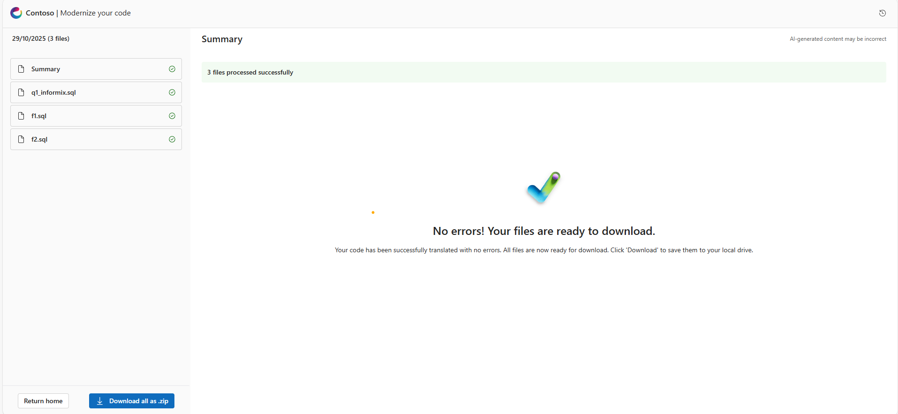

# Sample Workflow

To help you get started, here’s a **sample process** you can follow in the app.

## **Process**

> Note: Download Sample Data – The folder [here](../data/informix) contains sample Informix query files (simple and function) for download.

### **Upload**

_Sample Operations:_

- Select **q1_informix.sql** from _simple_ folder and **F1.sql** and **F2.sql** from _functions_ folder.
- Click **Upload** button.
- Click **Start Translating** Button to Process Files.

### **Review**

- The batch Processing page will open and the translation process will be visible. One file at a time will be processed and others will be in queued state.
- Once the batch processing is done for any file, the file is available to review.
- Once the translation process is complete for a batch, it becomes available for review in the History panel (located at the top right).
  
### **Download**

- Once the files are translated, the **Download all as .zip** button at the bottom left will be enabled to download the translated files.

  
  
This structured approach ensures that users can efficiently validate, test, and deploy cloud-ready solutions for improved scalability and performance.
